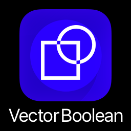
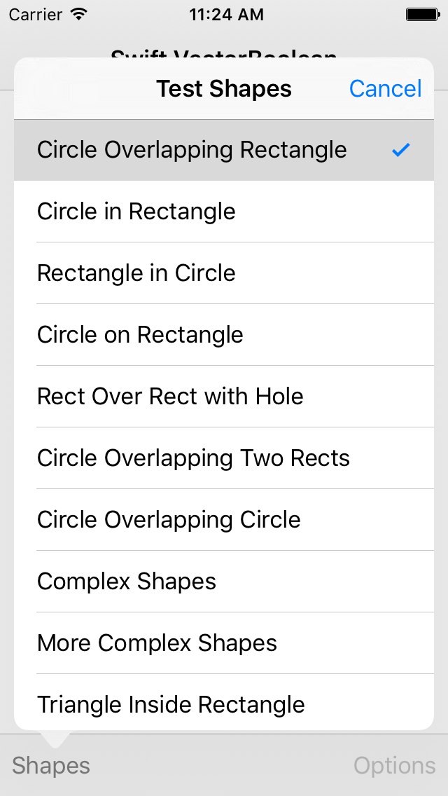
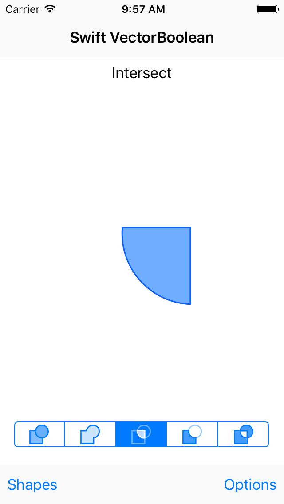
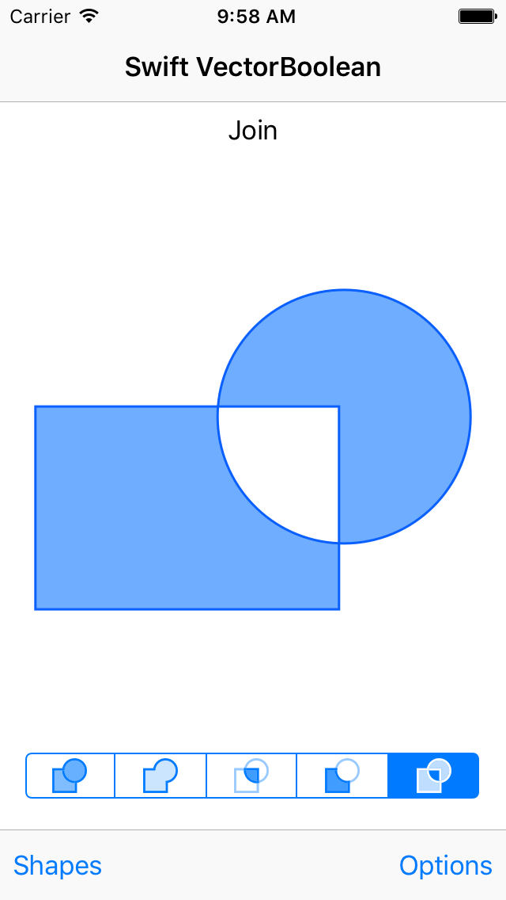
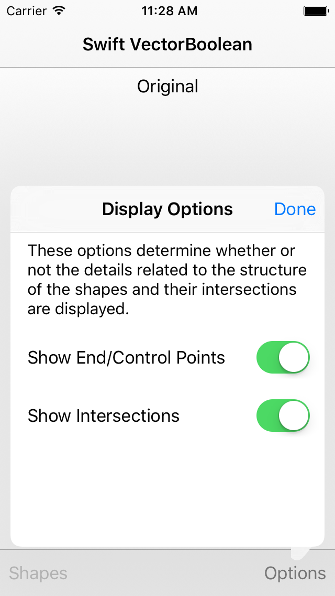
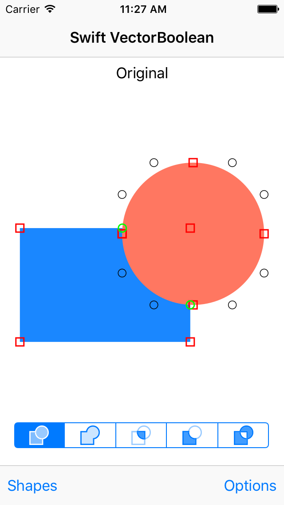

Swift VectorBoolean for iOS
===========================

### ✻ Updated for Xcode 9 and Swift 3.2

### Notes
 - Now contains a *framework* target thanks to [Lin Wang](https://github.com/an0).
 - Beginning to include CocoaPods support thanks to [Avishay Cohen](https://github.com/avishic).
 - Many thanks to [Louis D'hauwe](https://github.com/LouisDhauwe) for his work translating this entire project to Swift 3 for Xcode 8
 - The old version for Xcode 8 Swift 3 is available in the "Xcode_8_Swift_3" branch.
 - The old version for Xcode 7 Swift 2 is available in the "Xcode_7_Swift_2" branch.

## About VectorBoolean
This is an iOS rewrite of the code for Andy Finnell's article [How to implement boolean operations on bezier paths](http://losingfight.com/blog/2011/07/07/how-to-implement-boolean-operations-on-bezier-paths-part-1/). It is a literal translation of his original Objective-C Mac OS X [VectorBoolean](https://bitbucket.org/andyfinnell/vectorboolean) library with a tiny bit of Swifty goodness introduced.

It compiles under XCode 9 and includes an iOS app which tests the bezier operations and serves as an example of using the code.

I wrote this because I had a specific need for boolean operations on bezier paths in iOS. Rather than simply modifing the original Objective-C code to work on iOS, I bit the bullet and decided to redo it in Swift. Six months after beginning, I'm pleased to share it with you. I hope you enjoy it.

**Note:** *This code is now compatible with both 32-bit and 64-bit iOS devices.* Due to numeric precision limitations of the 32 bit version of iOS however, this code will misbehave on fractionally dimensioned bezier curves for the 32-bit case. For example, a line from 0.01, 0.01 to 0.02, 0.02 will be behave as a single point on an iPhone 4s but not on an iPhone 5s.

For the majority of applications this should not be a significant limitation.

## iOS Screens

